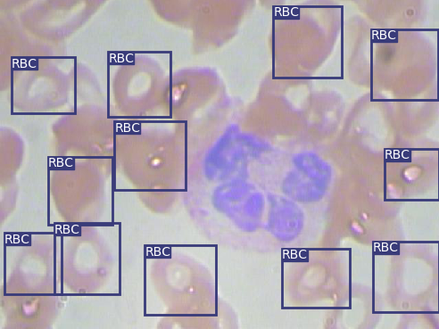
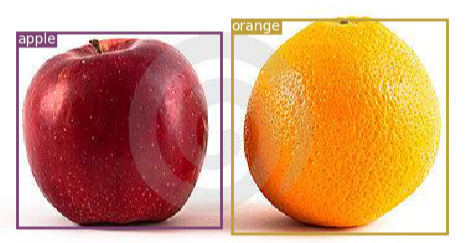

# PyTorch目标检测学习小结 #
## 一、环境搭建 ##
当前：Windows10 + Anaconda3.6
### 1.1 创建PyTorch的虚拟环境 ###
打开Anaconda中的Anaconda Prompt那个黑框框，输入：
```
#注意这里pytorch是自己设置的虚拟环境名称，可以随意取
conda create --name pytorch python=3.6
```
之后输入y，创建pytorch虚拟环境。以下是一些常规命令：

```
#进入到虚拟环境
activate pytorch

#切回root环境
activate root

#删除虚拟环境
conda remove -n pytorch --all

#查看当前存在哪些虚拟环境
conda info -e
```
### 1.2 安装PyTorch ###
链接PyTorch官网，可以任意选择安装环境   https://pytorch.org/
```
#例：无CUDA安装
conda install pytorch-cpu torchvision-cpu -c pytorch	
```

## 二、基础知识--Tensor ##
之前只用过Tensflow，学习pytorch时候，第一念头就是tensor，下面写一些入坑笔记，更多的pytorch知识参见文末的参考文献。

PyTorch中的Tensor常用类型有：float,int,bool...

Tensor和Numpy中的ndarray很多操作类似，两者之间也可以相互转换
### 2.1 Tensor的构建 ###
```python
import torch

a = torch.FloatTensor(2,3)	#2x3浮点型张量
c = torch.IntTensor(2,3)	#2x3整数型张量

b = torch.FloatTensor([1,2,3,4])	#浮点型张量2,3,4,5
d = torch.IntTensor([1,2,3,4])	##整数型张量2,3,4,5

i = torch.empty(2,3)	#创建一个2x3Tensor
e = torch.rand(2,3)	#随机生成2x3的浮点型Tensor，元素值在0~1区间均匀分布
f = torch.randn(2,3)	#随机生成2x3的浮点型Tensor，元素取值满足均值为0，方差为1的正态分布
g = torch.arange(2,8,1)	#自定义起始值2、结束值8、步长1的浮点型Tensor
h = torch.zeros(2,3,dtype=torch.long)	#元素值全部为0的2x3long型Tensor

#根据现有张量创建新张量，沿用之前的属性（除非重新设置）
x = torch.IntTensor(5,3)
x = x.new_ones(5, 3, dtype=torch.double)
x = torch.randn_like(x, dtype=torch.float)

#查看张量维度
print(x.size())	#返回tuple
```
### 2.2 Tensor的计算 ###
```python
import torch

#加(size和dtype需一致)
torch.add(a,c)	#a,c两张量对应元素相加
torch.add(a,10)	#张量a每个元素加10
c.add_(a)	#a+c并赋值到c
#NOTE:任何以_ 结尾的操作都会用结果替换原变量. 如: x.copy_(y), x.t_(), 都会改变 x.

#乘法(点乘)(size和dtype需一致)
torch.mul(a,c)	#a,c两张量对应元素相乘
torch.mul(a,10)	#张量a每个元素乘以10

#矩阵乘法(x乘)
torch.mm(a,c)	#张量a,c进行矩阵乘法

#除法(size和dtype需一致)
torch.div(a,c)	#a,c两张量对应元素相除
torch.div(a,10)	#张量a每个元素除以10

#幂
torch.pow(a,2)	#张量a的平方

#绝对值
torch.abs(a)	#张量a中元素值全部取绝对值

#元素值自定义裁剪
torch.clamp(a,-0.1,0.1)	#张量a的元素与上下边界0.1,-0.1比较，超过上边界的元素裁剪为0.1,超过下边界的裁剪为-0.1

#切片
#任何NumPy索引方式的操作适用于Tensor
print(a[:,1])	#返回第2列

#单元素Tensor取值
#若张量只有一个元素tensor([-1,2334])，可使用.item()来得到Python数据类型的数值
x.item()

#张量维度和大小改变
x = torch.randn(4, 4)
y = x.view(16)
z = x.view(-1, 8)  # -1 表示从其他维度推断
print(x.size(), y.size(), z.size())
#torch.Size([4, 4]) torch.Size([16]) torch.Size([2, 8])
```

## 三、小案例--YOLOv3红细胞检测 ##
这里主要用红细胞检测为案例（自己百度下载并标注了一些苹果橘子图片，同样流程也完成了目标检测），结果展示：





### 3.1 LabelImg数据标注 ###
对JPEGImages中的原始图像进行目标标注，使用的工具是LabelImg，YOLOV3的label标注的一行五个数分别代表类别编号，BoundingBox 中心 X 坐标，中心 Y 坐标，宽，高（这些坐标都是 0～1 的相对坐标）。labelImg下载及使用方法参见：
https://blog.csdn.net/python_pycharm/article/details/85338801#commentsedit

**最后将数据整理成两个个文档存在data/custom文件夹里**

**Annotations**存放标注后的xml文件

**JPEGImages**存放原始图片

红细胞、苹果橘子、钢筋标注后的数据下载参见
https://pan.baidu.com/s/1iFnjmvAsjJjxEg5BB5LQPg 
提取码：5xzs

### 3.2 数据预处理 ###
**1）复制JPEGImages，重命名为images**
	
	--为了和之后代码（utils/datasets.py）中路径保持一致
	
**2）建立两个空的文件夹ImageSets，labels**

**3）运行makeTxt.py**，将数据分为训练集，测试集和验证集
	
	--在ImageSets下得到四个txt文件，train,test,valid,trainval
	
**4）运行voc_label.py**（记得修改其中的classes为自己数据集要检测的类别），得到训练集，测试集和验证集的具体路径以及具体labels信息
	
	--得到train，test,valid三个txt，labels中的五点标注txt信息
	
其中makeTxt.py和voc_label.py参见https://blog.csdn.net/public669/article/details/98020800

### 3.3 文件配置 ###
**在data/custom目录下新建classes.names**--要检测物体的名称

**在config目录下新建custom.data**--一些声明，包括类别数、train和valid的路径、class.names

注：classes.names文件最后要留一个空行，不然会报错list index out of range，详情见
https://github.com/eriklindernoren/PyTorch-YOLOv3/issues/177

### 3.4 模型训练测试及试用 ###
代码参考的是大神的https://github.com/eriklindernoren/PyTorch-YOLOv3

因为coco数据集太大了，下载要好久，就考虑用小点的数据来学习，不过原代码已经保存好训练权重yolov3.weights了，可以直接进行coco数据集（80类）目标检测
```
#下载训练好的coco数据集权重
cd weights/
bash download_weights.sh

#目标检测
python3 detect.py --image_folder data/coco_samples/
```
--修改cfg中的learning_rate=0.005 #原来是0.001

--修改train和test.py中的batch_size=4 #原来为8，不改的话报错RuntimeError: CUDA out of memory.
```
#自定义模型
cd config/
bash create_custom_model.sh 1	#红细胞检测只有一个类别,苹果橘子测试有两个类别，根据需求更改

#模型训练
cd /home/kiki/PyTorch-YOLOv3	#注意修改成自己的路径
python3 train.py --model_def config/yolov3-custom.cfg --data_config config/custom.data --epochs 500
#--最后Total Loss 0.165

#查看Tensorboard
tensorboard --logdir=PATH\logs

#测试
python3 test.py --model_def config/yolov3-custom.cfg --data_config config/custom.data --weights_path checkpoints/yolov3_ckpt_499.pth --class_path data/custom/classes.names
#--最后AP=0.782，mAP=0.782

#红细胞检测
python3 detect.py --image_folder data/samples/ --model_def config/yolov3-custom.cfg --weights_path checkpoints/yolov3_ckpt_499.pth --class_path data/custom/classes.names --checkpoint_model checkpoints/yolov3_ckpt_499.pth  --conf_thres 0.95 --nms_thres 0.4
```

### 3.5 踩过的坑 ###
踩过的坑有很多，没有一一记录，选几个常见的报错整理了下：
#### 1、执行detect.py出错 ####
```
python3 detect.py --image_folder data/coco_samples/
命令行执行报错：
qt.qpa.screen: QXcbConnection: Could not connect to display 
Could not connect to any X display.
```
原因：没装Xmanager，装上就好了，Xmanager下载地址：http://www.xshellcn.com/

#### 2、执行train.py报错ValueError: not enough values to unpack (expected 3, got 0) ####
修改：大神的train.py中150行

if epoch % opt.evaluation_interval == 0:

改为

if epoch % opt.evaluation_interval == 1:

#### 3、执行train.py报错IndexError: index 0 is out of range ####
重复构建模型，删除已有的yolov3-custom.cfg模型，重新bash create_custom_model.sh <num_class>

#### 4、执行train.py报错RuntimeError: cannot perform reduction function max on tensor with no elements because the operation does not have an identity ####
检查data/custom中的数据，xml文件和图片个数是否一致，labels中是否有空的txt等

## 参考资料 ##
https://github.com/zergtant/pytorch-handbook

https://pytorch.org/tutorials/

https://github.com/L1aoXingyu/code-of-learn-deep-learning-with-pytorch

https://blog.csdn.net/public669/article/details/98020800

https://github.com/eriklindernoren/PyTorch-YOLOv3

http://www.pianshen.com/article/1287380494/
